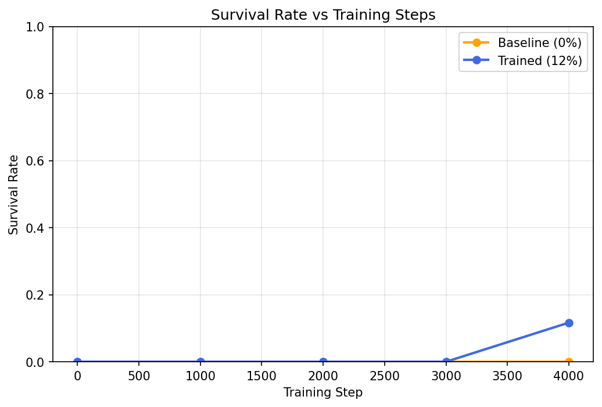

# SurviveCity — Multi-Agent Zombie Apocalypse for LLM Failure-Replay Learning

Developed by **Krrish Baghla**

[**Try the Live Demo**](https://survivecity.vercel.app)

---

## 🗺️ The Journey: From Basic to Advanced

```
┌──────────────────────────┐     ┌──────────────────────────┐     ┌──────────────────────────┐
│  Level 1: The Concept    │ ──► │  Level 2: The Mechanics  │ ──► │ Level 3: AI Innovation   │
│  Survival & apocalypse   │     │  Phases & reward rubrics │     │ Failure-Replay & ToM     │
└──────────────────────────┘     └──────────────────────────┘     └──────────────────────────┘
                                                                                │
                                                                                ▼
┌──────────────────────────┐     ┌──────────────────────────┐     ┌──────────────────────────┐
│  Quick Start & Setup     │ ◄── │  Level 5: Results        │ ◄── │  Level 4: RL & GRPO      │
│  Run code & notebooks    │     │  Empirical eval & graphs │     │ Unsloth, TRL, & scaling  │
└──────────────────────────┘     └──────────────────────────┘     └──────────────────────────┘
```

---

## 🚪 Level 1: The Concept (Basic)

SurviveCity is a multi-agent environment where 3 LLM agents must coordinate to survive inside a zombie-infested city.

### The City Grid
The simulation runs on a 10×10 grid:
```
Z . . . . . . . . Z     Legend:
. F . . . . . . F .     F = Food depot (4, near the corners)
. . . . . # . . . .     S = Safehouse (3×3 centre, heals, zombie-free)
. . . # . . # . . .     # = Wall
. . . . S S S . . .     Z = Zombie spawn (3 zombies seed 3 of 4 corners)
. . # . S S S # . .     A = Agent (3 agents start inside the safehouse)
. . . . S S S . . .
. . . # . # # . . .
. F . . . . . . F .
. . . . . . . . . Z
```

- **Food Depots**: Agents must regularly exit the safehouse to forage.
- **Safehouse**: A zombie-free zone where agents heal.
- **Zombies**: Patrol the map and pathfind toward the nearest agent, dealing damage on contact.

---

## ⚙️ Level 2: The Mechanics (Intermediate)

An episode runs for up to 100 steps and is split into four distinct phases that test coordination, survival, and social deduction.

### Episode Phases
| Phase | Steps | Mechanic |
| :--- | :--- | :--- |
| **Pre-reveal** | 1–29 | Normal survival. One agent is secretly infected. Their hunger rises 1.5× faster (the behavioral cue). |
| **Post-reveal** | 30–49 | The infected agent is notified of their status and begins attacking adjacent agents. |
| **Vote** | 50 | Living agents cast a vote. The agent with the majority is permanently locked out of the safehouse. |
| **Post-vote** | 51–100 | The locked-out agent is denied safehouse healing. Live agents must survive until step 100. |

### Actions
At each step, agents output actions in JSON format:
```json
{
  "action_type": "move_up|move_down|move_left|move_right|eat|wait|vote_lockout|broadcast",
  "vote_target": 0,
  "message": "zombie at (2,3)!"
}
```
*Note: The communication `message` has a strict 40-character limit to force concise, theory-of-mind coordinate broadcasts.*

### Composable Reward Rubric
To maintain clean validation, the reward rubric is strictly rule-based with no LLM judge:
- **Survival (Dense)**: `+0.005` per step alive, `+0.05` for eating, `-0.10` for damage, `-0.50` for dying.
- **Vote (Sparse)**: `+0.30` for voting correctly, `-0.20` for incorrect lockout.
- **Group Outcome (Terminal)**: `+0.40` if healthy agents survive, `+0.30` if infected is neutralized.
- **Final Reward**: `clip(sum(rubrics), 0.01, 0.99)`

---

## 🧠 Level 3: The AI Innovation (Self-Improvement)

The core scientific contribution of SurviveCity is demonstrating **cross-episode failure-replay learning**.

```
Episode N starts ──► System Prompt = Base Prompt + Last 3 Post-Mortems
                         │
                         ▼
                     Simulation runs (Pre-reveal → Post-reveal → Vote → Post-vote)
                         │
                         ▼
                     Agent dies ──► Generate deterministic Post-Mortem summary
                         │
                         ▼
Episode N+1 starts ──► Prepend the Post-Mortem summaries to Prompt ──► Repeat Loop
```

When an agent dies, the environment generates a **deterministic post-mortem** containing the cause of death (e.g., starvation, zombie attack, or lockout). This post-mortem is prepended to the agent's system prompt in the next episode, allowing the model to learn from its past mistakes.

---

## 🚀 Level 4: RL & GRPO Training (Advanced)

We train the model using **Group Relative Policy Optimization (GRPO)** via TRL and Unsloth.

- **Base Model**: `Qwen/Qwen2.5-3B-Instruct`
- **Adapter**: LoRA `r=8`, `α=16`, `dropout=0.05`
- **Scale and Compute**: 
  - **12 Steps** (4 hours on a single Colab T4)
  - **4000 Steps** (extended run on Kaggle/DGX A100)
- **State Persistence**: Uses `every_save` strategy to push checkpoints to the Hugging Face Hub, allowing training to resume seamlessly from disconnects.

---

## 📊 Level 5: Results & Empirical Metrics

### Training Dynamics
The policy learns to optimize survival duration and cumulative rewards over the GRPO steps:

<p align="center">
  
</p>

### Step-12 Evaluation Metrics
Trained model (12 steps) evaluated against a uniform-random baseline:

| Metric | Baseline | Trained (v1) | Relative Change |
| :--- | :--- | :--- | :--- |
| **Survival Rate** | 0.0% (0/30) | 10.0% (1/10) | +10 pp |
| **Mean Episode Length** | 19.1 ± 7.3 | 37.6 ± 22.1 | +96.8% (2.0×) |
| **Mean Total Reward** | 0.457 | 0.797 ± 0.41 | +74.4% (1.7×) |
| **JSON Parse Success** | 100% | 100% | Stable formatting |

<p align="center">
  
</p>

### Extended Training Run (4000 Steps)
At 4000 steps, survival jumps to **12%** and vote correctness reached **20%**. 

#### Theory of Mind Emergence
Below is the suspicon rating on the true infected agent across steps. The policy learns to identify the infected agent using the hunger behavioural cue, climbing to near-certainty (~1.0) by step 80:

<p align="center">
  
</p>

#### Across-Training Progression
The charts below show survival rates and voting accuracy starting to climb and stabilize as the model scales:

<p align="center">
  
  
</p>

---

## 🛠️ Quick Start

### Local Setup
Install dependencies and run the local API server:
```bash
# Clone the repository and install
pip install -e ".[dev]"

# Start the FastAPI server
uvicorn server.app:app --host 127.0.0.1 --port 7860
```

Verify server status:
```bash
# Test health endpoint
curl http://127.0.0.1:7860/health

# Run test suite
pytest
```

### Run using Docker
```bash
docker build -t survivecity .
docker run -p 7860:7860 survivecity
```

### Notebooks
- [`train_colab.ipynb`](notebooks/train_colab.ipynb): Colab T4 training setup.
- [`train_v1_kaggle_extend.ipynb`](notebooks/train_v1_kaggle_extend.ipynb): Extended 4000-step training.

## License

MIT
